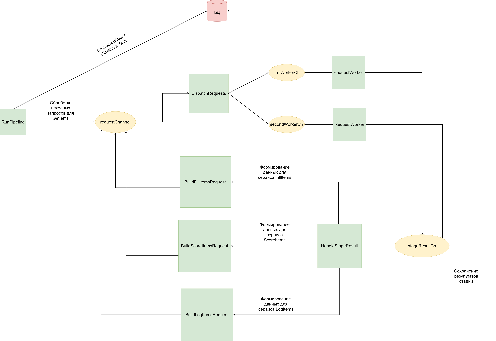

# Pipeline Processing Pet Project

Pet-project на Go для практики построения конкурентного pipeline обработки большого количества HTTP-запросов.

Проект охватывает работу с goroutines, channels, worker pool, fan-out, backpressure, graceful shutdown и обработку ошибок при взаимодействии с внешними сервисами и БД.

**Стек:** Go, PostgreSQL, Docker.

<details>
<summary><strong>1. Техническое задание</strong></summary>

Необходимо реализовать сервис для обработки большого количества URL(1 млн).

На вход сервис получает список URL. Для каждого URL создается отдельная задача обработки (`PipelineTask`).

```
requests_samples = [
('http://some-service/getItems/', {'user_id': 100}),  # вернет {item_ids: [1, 2, 3]}
('http://some-service/getItems/', {'user_id': 101}),
...
]
```

Обработка одной задачи состоит из нескольких стадий:

1. Выполнить запрос для каждого исходного URL(стадия `GetItems`) и получить список `item_ids`.
2. На основании полученных `item_ids` сформировать и выполнить три независимых запроса:
    - `FillItems`;
    - `ScoreItems`;
    - `LogItems`.
3. Результат выполнения каждой стадии сохранить в PostgreSQL.

                  GetItems
                     |
                     v
                  item_ids
               /     |     \
              v      v      v
        FillItems ScoreItems LogItems

Каждая стадия завершается со статусом success или failed.

Задача (PipelineTask) считается успешно завершенной, если успешно выполнены все четыре стадии:

- GetItems;
- FillItems;
- ScoreItems;
- LogItems.

Если хотя бы одна из стадий завершается с ошибкой, задача считается неуспешной.

Один запуск обработки всего списка URL представляет собой Pipeline. После завершения обработки всех задач необходимо определить их итоговые статусы и завершить Pipeline.
</details>

<details>
<summary><strong>2. Цели проекта</strong></summary>

Основная цель проекта — на практике разобраться с конкурентностью в Go и подходами к организации обработки большого количества независимых задач.

В рамках проекта хочется разобраться с:

- конкурентным выполнением задач с помощью goroutines;
- взаимодействием goroutine через channels;
- синхронизацией и координацией нескольких goroutine;
- управлением жизненным циклом goroutine;
- реализацией backpressure в Go;
- распространением сигнала отмены через `context.Context`;
- корректным закрытием channels при наличии нескольких producer-ов и consumer-ов;

</details>

<details>
<summary><strong>3. Упрощения</strong></summary>

Проект является учебным, поэтому в текущей реализации намеренно сделан ряд упрощений:

- pipeline запускается для одного пользователя;
- список исходных URL уже находится в памяти;
- pipeline запускается вручную;
- для обработки HTTP-запросов используются два worker-а — этого достаточно для демонстрации работы worker pool и конкурентной обработки задач.

Количество worker-ов намеренно не конфигурируется и не масштабируется динамически: на текущем этапе важно показать сам принцип организации конкурентной обработки, а не подобрать оптимальную степень параллелизма.

</details>

<details>
<summary><strong>4. Устройство проекта</strong></summary>

<details>
<summary><strong>4.1 Общая архитектура</strong></summary>



Pipeline построен вокруг нескольких долгоживущих goroutine, которые обмениваются задачами и результатами через channels.

Общий поток обработки выглядит следующим образом:

1. `RunPipeline` создает задачи для исходных URL и отправляет их в `requestChannel`.
2. `DispatchRequests` распределяет задачи между `RequestWorker`.
3. `RequestWorker` выполняет HTTP-запрос и отправляет результат в `stageResultCh`.
4. `HandleStageResult` сохраняет результат стадии в БД и определяет дальнейший маршрут задачи.
5. После успешного `GetItems` создаются три новые задачи — `FillItems`, `ScoreItems` и `LogItems`, которые снова отправляются в общий `requestChannel`.

Таким образом, все HTTP-стадии проходят через один и тот же worker pool:

```text
                      ┌──────────────────────┐
                      │                      │
                      v                      │
RunPipeline → requestChannel → RequestWorker │
                                    │        │
                                    v        │
                              stageResultCh  │
                                    │        │
                                    v        │
                            HandleStageResult┘
```

`GetItems` является единственной стадией, которая создает новые задачи:

```text
GetItems
   │
   ├── FillItems
   ├── ScoreItems
   └── LogItems
```

Из-за этого количество задач в pipeline заранее не фиксировано: во время обработки существующей задачи могут появляться новые.

Это влияет как на координацию goroutine, так и на определение момента завершения всего pipeline.

</details>

<details>
<summary><strong>4.2 Основные компоненты</strong></summary>

### RunPipeline

`RunPipeline` является точкой запуска обработки pipeline.

Он:

1. создает `Pipeline` в БД;
2. для каждого исходного URL создает `PipelineTask`;
3. формирует первую HTTP-задачу со стадией `GetItems`;
4. регистрирует задачу в `PipelineCoordinator`;
5. отправляет ее в `requestChannel`;
6. после отправки всех исходных URL ожидает завершения pipeline.

Таким образом, `RunPipeline` создает только начальные задачи. Все последующие стадии появляются динамически в процессе обработки результатов.

---

### requestChannel

`requestChannel` — общий канал для HTTP-задач всех стадий:

- `GetItems`;
- `FillItems`;
- `ScoreItems`;
- `LogItems`.

В канал пишут два компонента:

- `RunPipeline` — отправляет исходные `GetItems`;
- `HandleStageResult` — создает новые задачи после успешного выполнения `GetItems`.

```text
RunPipeline ──────────────┐
                         │
                         v
                   requestChannel
                         ^
                         │
HandleStageResult ────────┘
```

Использование общего канала позволяет всем HTTP-стадиям проходить через один worker pool.

---

### DispatchRequests

`DispatchRequests` читает задачи из `requestChannel` и распределяет их между `RequestWorker`.

```text
                requestChannel
                      │
                      v
              DispatchRequests
                 /         \
                v           v
        firstWorkerCh   secondWorkerCh
                │           │
                v           v
        RequestWorker   RequestWorker
```

`DispatchRequests` не выполняет HTTP-запросы и не содержит бизнес-логики обработки стадий. Его задача — только распределять входящие задачи между worker-ами.

---

### RequestWorker

`RequestWorker` отвечает за выполнение HTTP-запросов к внешним сервисам.

```text
      HTTP-задача
           │
           v
    RequestWorker
           │
           v
     HTTP request
           │
           v
   Результат запроса
           │
           v
    stageResultCh
```

`RequestWorker` не знает:

- как результат должен быть сохранен в БД;
- какие стадии должны выполняться дальше;
- когда весь pipeline считается завершенным.

Таким образом, worker отвечает только за выполнение HTTP-запроса и передачу результата дальше.

---

### stageResultCh

`stageResultCh` — общий канал результатов HTTP-запросов.

Producer-ами являются несколько `RequestWorker`, а consumer-ом — `HandleStageResult`.

```text
RequestWorker ─────┐
                   │
                   v
             stageResultCh
                   ^
                   │
RequestWorker ─────┘
                   │
                   v
           HandleStageResult
```

Такое разделение позволяет отделить выполнение HTTP-запроса от обработки его результата.

---

### HandleStageResult

`HandleStageResult` обрабатывает результаты завершенных HTTP-стадий.

Для каждого результата он:

- определяет статус стадии;
- сохраняет `StageResult` в БД;
- при необходимости запускает следующую часть pipeline.

Если успешно завершилась стадия `GetItems`, из полученных `item_ids` создаются три новые независимые задачи:

```text
              GetItems
                 │
                 v
         HandleStageResult
           /      |      \
          v       v       v
    FillItems ScoreItems LogItems
```

Для `FillItems`, `ScoreItems` и `LogItems` дальнейшие HTTP-стадии не создаются.

Новые задачи снова отправляются в общий `requestChannel` и обрабатываются тем же worker pool.

</details>

<details>
<summary><strong>4.3 Жизненный цикл задачи</strong></summary>

Каждый исходный URL обрабатывается в рамках отдельной `PipelineTask`.

Жизненный цикл задачи начинается в `RunPipeline`, где для URL создается `PipelineTask` и первая стадия — `GetItems`.

```text
URL
 │
 v
PipelineTask
 │
 v
GetItems
```

После выполнения HTTP-запроса результат стадии сохраняется в БД как `StageResult`.

Если `GetItems` завершился успешно, полученные `item_ids` используются для создания трех независимых стадий:

```text
                    PipelineTask
                         │
                         v
                     GetItems
                         │
                         v
                      item_ids
                    /    |    \
                   v     v     v
             FillItems ScoreItems LogItems
```

Результат каждой из этих стадий также сохраняется в БД как отдельный `StageResult`.

В результате одна полностью обработанная задача содержит результаты четырех стадий:

```text
PipelineTask
   │
   ├── GetItems   → StageResult
   ├── FillItems  → StageResult
   ├── ScoreItems → StageResult
   └── LogItems   → StageResult
```

После завершения обработки определяется итоговый статус `PipelineTask`.

Успешной считается задача, для которой успешно завершены все четыре стадии. Если одна из стадий завершается с ошибкой, дальнейшее выполнение зависит от того, на каком этапе произошла ошибка:

- ошибка `GetItems` не позволяет создать последующие стадии;
- ошибка `FillItems`, `ScoreItems` или `LogItems` не влияет на выполнение остальных независимых стадий.

</details>

<details>
<summary><strong>4.4 Хранение состояния и статусы</strong></summary>

Состояние выполнения pipeline хранится в PostgreSQL на трех уровнях:

```text
Pipeline
   │
   ├── PipelineTask
   │      │
   │      ├── GetItems   → StageResult
   │      ├── FillItems  → StageResult
   │      ├── ScoreItems → StageResult
   │      └── LogItems   → StageResult
   │
   ├── PipelineTask
   │      └── ...
   │
   └── PipelineTask
          └── ...
```

### Pipeline

`Pipeline` представляет один запуск обработки списка URL.

Он объединяет все задачи, созданные в рамках одного запуска, и хранит состояние выполнения pipeline в целом.

---

### PipelineTask

`PipelineTask` представляет обработку одного исходного URL.

```text
1 URL = 1 PipelineTask
```

Одна задача может содержать результаты нескольких стадий обработки.

После завершения pipeline для каждой задачи определяется итоговый статус:

- `success` — все необходимые стадии успешно выполнены;
- `failed` — хотя бы одна стадия завершилась неуспешно.

---

### StageResult

`StageResult` хранит результат выполнения отдельной стадии:

- `GetItems`;
- `FillItems`;
- `ScoreItems`;
- `LogItems`.

Для каждой выполненной стадии сохраняется ее статус и информация о результате запроса.

```text
PipelineTask
     │
     ├── StageResult(GetItems)
     ├── StageResult(FillItems)
     ├── StageResult(ScoreItems)
     └── StageResult(LogItems)
```

Хранение результатов отдельных стадий позволяет определить, на каком этапе завершилась обработка конкретной задачи и какая ошибка произошла.

---

### Определение итогового статуса задачи

`PipelineTask` считается успешно завершенной только в том случае, если успешно выполнены все четыре стадии:

```text
GetItems   = success
FillItems  = success
ScoreItems = success
LogItems   = success
             │
             v
PipelineTask = success
```

Если хотя бы одна стадия завершилась со статусом `failed`, итоговый статус задачи — `failed`.

```text
GetItems   = success
FillItems  = failed
ScoreItems = success
LogItems   = success
             │
             v
PipelineTask = failed
```

</details>

<details>
<summary><strong>4.5 Координация и завершение pipeline</strong></summary>

Количество задач в pipeline заранее неизвестно.

После выполнения `GetItems` могут появиться три новые задачи:

```text
GetItems
   │
   ├── FillItems
   ├── ScoreItems
   └── LogItems
```

Поэтому завершение обработки списка исходных URL еще не означает завершение всего pipeline.

Кроме того, определить завершение по состоянию channels нельзя: пустой channel означает только отсутствие сообщений в данный момент, но новые задачи могут быть созданы позже.

### PipelineCoordinator

Для определения момента логического завершения используется `PipelineCoordinator`.

Он отслеживает:

- количество созданных, но еще не завершенных задач;
- завершена ли отправка всех исходных URL.

Pipeline считается завершенным, когда выполняются оба условия:

```text
Все исходные URL отправлены
          +
Нет незавершенных задач
          =
Pipeline завершен
```

Новая задача регистрируется в coordinator **до** отправки в channel:

```text
Add → отправка задачи → обработка → Done
```

Это важно, потому что после публикации задачи другая goroutine может сразу начать и закончить ее обработку. Тогда счетчик
задач на короткое время может стать 0. И при обработке последнего исходного URL, мы можем отловить ложное завершение пайплайна.

При fan-out дочерние задачи также регистрируются до завершения родительского `GetItems`:

```text
counter = 1          GetItems

        ↓ Add(3)

counter = 4          GetItems + 3 новые задачи

        ↓ Done()

counter = 3          GetItems завершен

        ↓

counter = 0          все дочерние задачи завершены
```

Так счетчик не может временно стать равным нулю между завершением `GetItems` и созданием новых задач.

---

### Завершение goroutine

`PipelineCoordinator` отвечает только за **логическое завершение pipeline**.

Для ожидания завершения самих goroutine используется `sync.WaitGroup`.

Эти механизмы решают разные задачи:

```text
PipelineCoordinator → закончилась ли работа pipeline
sync.WaitGroup       → завершились ли goroutine
```

---

### Закрытие channels

Channels закрываются последовательно, после завершения всех producer-ов соответствующего channel.

```text
PipelineCoordinator.Wait()
        │
        v
close(requestChannel)
        │
        v
DispatchRequests finishes
        │
        v
close(worker channels)
        │
        v
RequestWorkers finish
        │
        v
close(stageResultCh)
        │
        v
HandleStageResult finishes
        │
        v
Все goroutine завершены
```

После завершения pipeline новые HTTP-задачи больше не могут появиться, поэтому закрывается `requestChannel`.
`DispatchRequests` дочитывает его и после завершения закрывает worker channels.
После этого `RequestWorker` завершают оставшиеся задачи. Когда завершились все worker-ы, можно безопасно закрыть `stageResultCh`.
`HandleStageResult` дочитывает оставшиеся результаты и завершает работу после закрытия `stageResultCh`.
Таким образом, каждый channel закрывается только после того, как гарантированно завершились все его producer-ы.

</details>

<details>
<summary><strong>4.6 Запуск проекта и тестов</strong></summary>

Для локальной работы проект использует PostgreSQL в Docker и локальный mock-сервер, имитирующий внешние HTTP-сервисы.

### Первый запуск

#### 1. Настроить переменные окружения

Создать `.env` в корне проекта:

```env
DB_HOST=localhost
DB_PORT=5432
DB_NAME=urls_etl
DB_USER=urls_etl
DB_PASSWORD=urls_etl
DB_SSLMODE=disable
MOCK_SERVER_LOG_LEVEL=debug
```

#### 2. Запустить PostgreSQL

```bash
docker compose up -d postgres
```

PostgreSQL запускается в Docker и доступен на `localhost:5432`.

#### 3. Применить миграции

SQL-миграции находятся в директории:

```text
migrations/
```

Для управления миграциями используется `golang-migrate`.

Применить все новые миграции:

```bash
go run ./cmd/migrate up
```

Откатить последнюю миграцию:

```bash
go run ./cmd/migrate down
```

Посмотреть текущую версию схемы БД:

```bash
go run ./cmd/migrate version
```

#### 4. Запустить mock-сервер

Вместо реальных внешних сервисов проект использует локальный mock-сервер.

Точка входа:

```text
cmd/mock_server/
```

Запуск:

```bash
go run ./cmd/mock_server
```

Mock-сервер запускается на порту `8080` и имитирует четыре внешних endpoint-а:

```text
/getItems
/service1/fillItems
/service2/scoreItems
/service3/logItems
```

Mock-сервисы возвращают искусственные данные и могут генерировать ошибки, что позволяет проверять поведение pipeline 
при успешных запросах, retryable и non-retryable ошибках.

#### 5. Запустить приложение

В отдельном терминале:

```bash
go run ./cmd/app
```

Итоговая последовательность первого запуска:

```text
PostgreSQL
    │
    v
Миграции
    │
    v
Mock Server
    │
    v
Application
```

---

### Повторный запуск

Запустить PostgreSQL:

```bash
docker compose up -d postgres
```

Применить новые миграции, если они появились:

```bash
go run ./cmd/migrate up
```

Если новых миграций нет, команда завершится без изменения схемы БД.

Затем запустить mock-сервер:

```bash
go run ./cmd/mock_server
```

И в отдельном терминале приложение:

```bash
go run ./cmd/app
```

---

### Запуск с чистой БД

Если необходимо удалить состояние предыдущих запусков и запустить проект с чистой БД, сначала нужно остановить PostgreSQL 
и удалить Docker volume:

```bash
docker compose down -v
```

После этого PostgreSQL и структура БД создаются заново:

```bash
docker compose up -d postgres
go run ./cmd/migrate up
```

Затем в отдельных терминалах запускаются mock-сервер:

```bash
go run ./cmd/mock_server
```

и приложение:

```bash
go run ./cmd/app
```

---

### Запуск тестов

Запустить все тесты проекта:

```bash
go test ./...
```

Запустить все тесты с подробным выводом:

```bash
go test -v ./...
```

</details>
</details>

<details>
<summary><strong>5. Идеи для дальнейшего улучшения</strong></summary>

### 1. Конфигурируемый worker pool

Сейчас количество `RequestWorker` зафиксировано в коде.

В дальнейшем хочется:

- вынести количество worker-ов в конфигурацию;
- динамически создавать нужное количество worker channels и goroutine;
- исследовать возможность изменения количества worker-ов во время работы pipeline.

В перспективе количество worker-ов можно автоматически увеличивать или уменьшать в зависимости от нагрузки на pipeline.

---

### 2. Батчевое создание PipelineTask

Сейчас `RunPipeline` сохраняет каждый `PipelineTask` в БД отдельным запросом.

При обработке большого количества URL это приводит к большому количеству последовательных обращений к PostgreSQL.

Планируется создавать `PipelineTask` батчами:

```text
batch URL
    ↓
batch INSERT PipelineTask
    ↓
получение task_id
    ↓
отправка GetItems в обработку
    ↓
следующий batch

Это позволит уменьшить количество обращений к БД и ускорить отправку большого количества исходных задач.

При этом bounded channels уже обеспечивают backpressure: если worker pool не успевает обрабатывать задачи, заполнение channels постепенно блокирует producer и не позволяет ему бесконтрольно продолжать отправку новых задач.
---

### 3. Rate limiting

Добавить rate limiter для ограничения количества запросов к внешним сервисам.

Планируется реализовать алгоритм `leaky bucket` и исследовать его взаимодействие с worker pool и backpressure.

---

### 4. Управление pipeline

Добавить возможность управлять уже запущенным pipeline.

Планируются три отдельных действия:

- **stop / pause** — перестать брать новые задачи, позволив текущим завершиться;
- **continue / resume** — продолжить выполнение остановленного pipeline;
- **cancel** — полностью прекратить дальнейшую обработку pipeline.

Для управления pipeline можно добавить отдельный HTTP API.

---

### 5. Трекинг прогресса

Добавить возможность получать состояние выполняющегося pipeline в реальном времени:

- общее количество задач;
- количество завершенных задач;
- количество успешных и неуспешных задач;
- текущий процент выполнения.

Для доставки обновлений клиенту можно использовать WebSocket или Server-Sent Events.

---

### 6. Промежуточное обновление статусов

Сейчас итоговые статусы `PipelineTask` рассчитываются после завершения всего pipeline.

Для больших pipeline хочется обновлять статусы постепенно, по мере завершения отдельных задач или batch-ей.

Это позволит получать актуальное состояние pipeline еще до полного окончания обработки.

---

### 7. Повторные попытки выполнения стадий

Сейчас модель статусов рассчитана на одну итоговую попытку выполнения каждой стадии.

При добавлении повторных запусков необходимо хранить историю попыток и при определении итогового состояния учитывать последнюю попытку для каждой пары:

```text
task_id + stage
```

---

### 8. Защита PipelineCoordinator от бесконечного ожидания

Сейчас `PipelineCoordinator.Wait()` может ожидать неограниченно долго, если из-за ошибки какая-либо зарегистрированная задача никогда не вызовет `Done()`.

Необходимо добавить механизм отмены или timeout через `context.Context`, чтобы pipeline мог корректно завершиться даже при нарушении ожидаемого жизненного цикла задачи.

---

### 9. Circuit Breaker

Добавить Circuit Breaker для защиты pipeline от длительно недоступных внешних сервисов.

Если внешний сервис стабильно возвращает ошибки, pipeline не должен бесконечно продолжать отправлять заведомо неуспешные запросы.

Circuit Breaker позволит временно прекращать обращения к проблемному сервису и через некоторое время проверять, восстановилась ли его работа.

Это также интересно с точки зрения взаимодействия Circuit Breaker с retry-механизмом, worker pool и rate limiter.

### 10. Итоговая статистика pipeline

После завершения pipeline формировать статистику выполнения:

- общее количество задач;
- количество успешных и неуспешных задач;
- продолжительность выполнения;
- throughput;
- количество ошибок;
- количество retry;
- статистику по отдельным стадиям.

</details>

