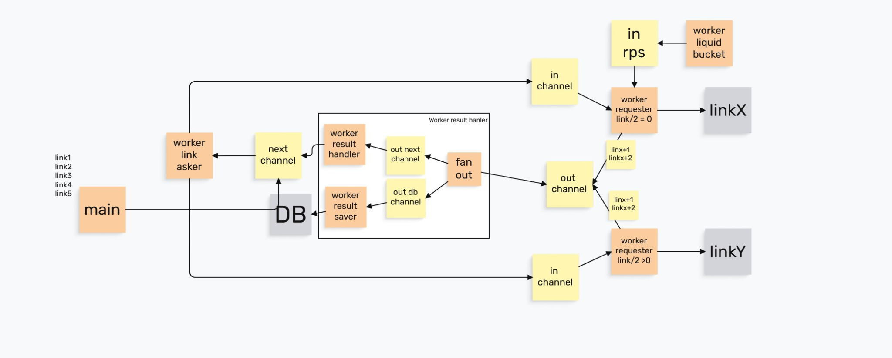

# Pipeline Processing Pet Project

## ТЗ
Задача:
Дан список из 1 миллиона url, которые нужно опросить. Из каждого url получить несколько item id и
опросить 3 независимых сервиса c этими данными для данных из всех 3х сервисов собрать итоговый ответ и
сохранить результат в список. После этого список нужно обработать, обработка элементов списка CPU-bound

```
requests_samples = [
  ('http://some-service/getItems/', {'user_id': 100}),  # вернет {item_ids: [1, 2, 3]}
  ('http://some-service/getItems/', {'user_id': 101}),
    ...
]

service_1_url = 'http://service1/fillItems/'
service_2_url = 'http://service2/scoreItems/'
service_3_url = 'http://service3/logItems/'
```

## Описание проекта

Тренировочный pet-project на Go для практики:

- goroutines
- channels
- worker pool
- fan-out / fan-in
- rate limiting
- backpressure
- graceful shutdown
- pipeline architecture

Проект представляет собой сервис для обработки большого количества URL.

## Бизнес-логика

1. Пользователь запускает pipeline.
2. Pipeline получает список URL.
3. Сервис делает запрос к каждому URL.
4. Результат запроса отправляется в 3 внешних сервиса.
5. Результаты от каждого сервиса сохраняются в БД.

---

# MVP

## Упрощения первой версии

В первой версии:

- только один пользователь;
- список URL уже находится в памяти;
- pipeline запускается вручную;
- без Kafka и брокеров сообщений;
- без pause/resume;
- без распределённой системы.

---

## Что нужно реализовать

### 1. Pipeline обработки URL

Сервис запускает обработку списка URL.

---

### 2. Worker pool для URL

Несколько worker-ов:

- читают URL из channel;
- делают HTTP-запрос;
- передают результат дальше в pipeline.

---

### 3. Fan-out на 3 внешних сервиса

После обработки URL результат нужно отправить:

- в Service A;
- в Service B;
- в Service C.

---

### 4. Worker-ы для внешних сервисов

Для каждого сервиса:

- свой channel;
- свой worker pool;
- свои HTTP-запросы.

---

### 5. Rate limiting

Нужно ограничивать скорость запросов к внешним сервисам.

Изучить:

- `net/http.Transport`
- `MaxConnsPerHost`
- token bucket
- leaky bucket
- liquid bucket

---

### 6. Сохранение результатов

Результат ответа каждого сервиса сохраняется в БД.

---

### 7. Backpressure

Использовать bounded channels, чтобы:

- не создавать миллион goroutine;
- ограничивать нагрузку;
- естественно замедлять pipeline при медленной БД или внешних сервисах.

---

### 8. Context и graceful shutdown

Использовать:

- `context.Context`
- корректную остановку worker-ов;
- завершение pipeline без потери данных.

---

# Предполагаемая архитектура



```text
Producer
    ->
URL Workers
    ->
Fan-Out
    ->
Service Workers
    ->
DB Saver
```

---

# Что изучить

## Go concurrency

- goroutines
- channels
- select
- sync.WaitGroup
- mutex / RWMutex
- worker pool pattern
- fan-out / fan-in

## HTTP

- `net/http`
- `http.Transport`
- `MaxConnsPerHost`
- `MaxIdleConns`
- `MaxIdleConnsPerHost`
- connection pooling

## Reliability

- graceful shutdown
- backpressure
- rate limiting
- retry policy
- context cancellation

---

# Идеи для дальнейшего улучшения

## 1. Сохранение каждого stage в БД

Хранить не только финальный результат, но и состояние каждого этапа:

- URL получен;
- URL обработан;
- запрос в Service A выполнен;
- запрос в Service B выполнен;
- запрос в Service C выполнен;
- результат сохранён;
- ошибка на конкретном этапе.

---

## 2. Трекинг прогресса pipeline

Отображать:

- сколько задач ожидает;
- сколько в обработке;
- сколько успешно завершено;
- сколько упало;
- сколько задач находится на каждом stage.

---

## 3. Статистика

Собирать:

- общее количество URL;
- количество успешных/неуспешных;
- throughput;
- среднее время обработки;
- ошибки по сервисам;
- retry count.

---

## 4. Pause / Continue

Pipeline можно:

- поставить на паузу;
- продолжить позже.

Идея:

- worker-ы перестают брать новые задачи;
- текущие задачи завершаются;
- состояние сохраняется в БД;
- при continue незавершённые задачи снова попадают в pipeline.

---

## 5. Конфигурация worker-ов

Настраиваемое количество worker-ов:

- URL workers;
- Service A workers;
- Service B workers;
- Service C workers;
- DB workers.

---

## 6. Динамическое масштабирование worker-ов

Возможность:

- добавлять worker-ы во время выполнения pipeline;
- ускорять обработку.

---

## 7. Retry policy

Retry для временных ошибок:

- timeout;
- network errors;
- 5xx ошибки;
- временные ошибки БД.

---

## 8. Resume после падения приложения

После рестарта приложения:

- поднять незавершённые задачи из БД;
- продолжить pipeline с последнего stage.

---

# Главная идея проекта

- goroutines выполняют работу;
- channels передают задачи между этапами;
- worker-ы ограничивают конкурентность;
- rate limiter ограничивает RPS;
- БД хранит состояние pipeline.
